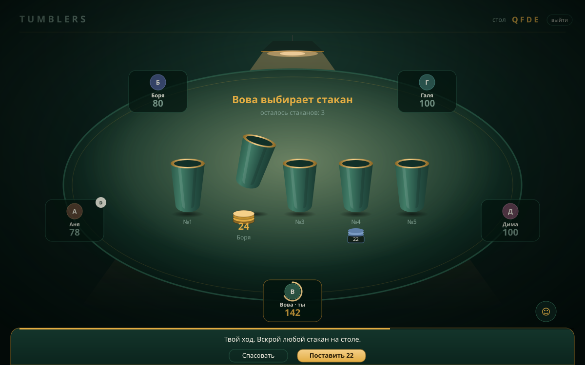
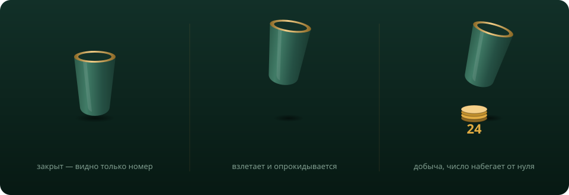

<div align="center">

# TUMBLERS

**Игра на блеф для 2–8 человек.**
Дилер прячет фишки под стаканы. Остальные торгуются за очередь,
ставят вслепую и вскрывают — по одному, на глазах у всех.


<br>



</div>

<br>

## О чём игра

Каждый раунд один человек становится дилером. Он прячет свои фишки под стаканы —
сколько куда, знает только он. Может рассыпать поровну, может спрятать всё под
один и оставить остальные пустыми.

Остальные сначала торгуются за право вскрывать первым, потом ставят на стаканы
вслепую, потом по очереди вскрывают. Последний стакан всегда достаётся дилеру,
и сосед слева доплачивает ему половину.

Чужие балансы во время раунда заморожены. Открыты только ставки и уже вскрытые
стаканы — из этого и приходится считать.

Кто обнулился, тот закончил партию. Места распределяются по фишкам оставшихся.

<br>

## Момент вскрытия

<div align="center">

</div>

Стакан приседает, взлетает и опрокидывается набок, из-под него разлетаются фишки,
сумма отсчитывается от нуля, место победителя коротко вспыхивает. Пустой стакан
вскрывается иначе: глухо оседает, покачивается и выпускает облачко пыли.
Разницу между «повезло» и «пусто» видно боковым зрением.

<br>

## Запуск

```bash
npm install
npm start
```

Открыть <http://localhost:3000>, собрать стол, отправить друзьям код из четырёх букв
или ссылку.

**Посмотреть в одиночку.** В соседнем окне терминала:

```bash
npm run bots -- QFDE 2
```

Боты сядут за стол и сыграют партию сами: раскладывают, торгуются, ставят,
вскрывают и кидают реакции. Останавливаются по `Ctrl+C`.

**Тесты правил**, без сети и без сервера:

```bash
npm test
```

Прогоняются в том числе сто партий подряд с проверкой, что сумма фишек за столом
не меняется никогда.

<br>

## Правила

### Ход раунда

| | Этап | Что происходит |
|---|---|---|
| 1 | **Раскладка** | Дилер прячет фишки под стаканы. Стаканов столько же, сколько игроков, в любой можно положить ноль. Выложить нужно минимум **10% от самого большого стека за столом**; если у дилера меньше — он выкладывает всё. |
| 2 | **Торги** | Каждый недилер называет ставку или пасует. Кто назвал больше — вскрывает первым, дальше по убыванию ставок, следом спасовавшие в порядке посадки. Спасовали все — раунд идёт без ставок. |
| 3 | **Ставки** | Ставят только участники торгов. Победитель **обязан** поставить не меньше названного, остальные — по желанию. Ставки открытые, их видно всем. |
| 4 | **Вскрытие** | Каждый недилер вскрывает один стакан. Последний открывает дилер. |
| 5 | **Доплата** | Игрок слева от дилера доплачивает ему половину последнего стакана с округлением вверх. Не хватает фишек — не платит. |

Дальше дилером становится следующий по кругу.

### Ставки на стаканы

Минимальная ставка — **20% от самого большого стека**, то есть две минимальные
раскладки дилера. Нет столько фишек — ставишь всё, что есть.

Ставки разыгрываются в момент вскрытия, по очереди от первого поставившего,
и содержимое стакана по ходу тает:

- фишек в стакане **больше** ставки → игрок забирает ставку обратно и уносит из
  стакана столько же;
- фишек **меньше или ровно** → ставка сгорает и достаётся тому, кто вскрыл стакан.

Вдвоём торгов и ставок нет: дилер раскладывает, соперник вскрывает свой стакан,
последний забирает дилер.

<details>
<summary><b>Время, обрывы связи и выход</b></summary>

<br>

На ход даётся **60 секунд**. Не успел — сервер играет за тебя: раскладывает по
минимуму, пасует в торгах, вскрывает случайный стакан.

Оборвалась связь — место держится **90 секунд**. Не вернулся, выбываешь.

Кнопка «выйти» освобождает место сразу и навсегда: фишки делятся поровну между
оставшимися, вернуться в эту партию уже нельзя, только смотреть. Если посреди
раздачи выходит дилер, стаканы возвращаются столу и раздача начинается заново.

Зайти наблюдателем можно кнопкой «Смотреть». Все, кто пришёл после начала партии,
садятся смотреть и попадают за стол в следующей.

</details>

<br>

## Что внутри

**Считает всё сервер.** Содержимое закрытых стаканов и чужие балансы клиенту не
отправляются — подсмотреть через инструменты разработчика нечего.

**Экран целиком, без прокрутки.** Тонкая шапка, стол и док действий внизу. Кнопка
хода всегда на месте. Док показывает только то, что нужно для текущего решения:
ползунок ставки в торгах, счётчики стаканов у дилера, таблицу мест в конце.

**Свет.** Над столом висит лампа: тёплый конус падает сверху, в центре сукна
горячее пятно, к бортам всё уходит в темноту. Тот, чей ход, попадает в пятно
света. Температура взята близкой к 2700–3000K — так делают настольный свет
в игровых комнатах, холодные 5000K выглядят как офис.

**Фишки — это фишки.** Добыча под вскрытым стаканом, ставки перед закрытым,
перелёты к местам — везде стопки дисков, высота соответствует сумме. У каждого
игрока свой цвет: он на аватаре и на его ставках.

**Ни одной картинки.** Стаканы, фишки, сукно с ворсом и свет лампы нарисованы
svg и css. Из внешнего — только шрифты с Google Fonts, при недоступности всё
откатывается на системный.

<br>

## Устройство

```
server/
  index.js   транспорт: express, websocket, разбор сообщений, лимит частоты
  game.js    правила: чистые функции над объектом стола, без сети и таймеров
  rooms.js   реестр столов, вход и выход, общий тик, восстановление
  store.js   запись состояния в json-файл
public/
  index.html разметка и svg-заготовки
  styles.css оформление
  app.js     связь, отрисовка стола, анимации
tools/
  test.js    тесты правил
  bots.js    боты для локальной проверки
```

Правила отделены от сети намеренно: `game.js` не знает про сокеты, поэтому его
можно прогонять тестами сотнями партий подряд.

Действие по таймеру выводится из фазы, а не хранится замыканием, поэтому переживает
перезапуск сервера. Общий цикл раз в 250 мс проверяет у всех столов просроченные
сроки хода и паузу перед вскрытием последнего стакана.

Столы сохраняются в `data/rooms.json` и восстанавливаются при запуске.

<br>

## Развернуть

<details>
<summary><b>Render — бесплатно и без карты</b></summary>

<br>

1. Залить файлы в репозиторий на GitHub. `package.json` должен лежать **в корне**.
2. render.com → **New → Web Service** → выбрать репозиторий.
3. Language **Node**, Build Command `npm install`, Start Command `npm start`,
   Instance Type **Free**.

Порт берётся из `process.env.PORT`, WebSocket работает по тому же адресу.
Если репозиторий вышел с вложенной папкой — Settings → Build & Deploy →
**Root Directory**.

Бесплатный сервис засыпает после 15 минут без запросов и просыпается примерно
за минуту. Чтобы не засыпал, повесить бесплатный монитор UptimeRobot на `/healthz`
с интервалом 5 минут.

Диск на бесплатном тарифе непостоянный, так что после засыпания сохранённые столы
пропадают. Для настоящей устойчивости — платный диск Render либо `STATE_FILE`
на смонтированном томе.

</details>

<details>
<summary><b>Переменные окружения</b></summary>

<br>

| Переменная | По умолчанию | Что делает |
|---|---|---|
| `PORT` | `3000` | Порт сервера |
| `TURN_MS` | `60000` | Время на ход |
| `RECONNECT_MS` | `90000` | Сколько держится место после обрыва связи |
| `REVEAL_MS` | `1800` | Пауза перед вскрытием последнего стакана |
| `STATE_FILE` | `data/rooms.json` | Куда писать состояние столов |

Маленькие `TURN_MS` и `RECONNECT_MS` удобны для отладки: партия прогоняется
за секунды.

</details>
